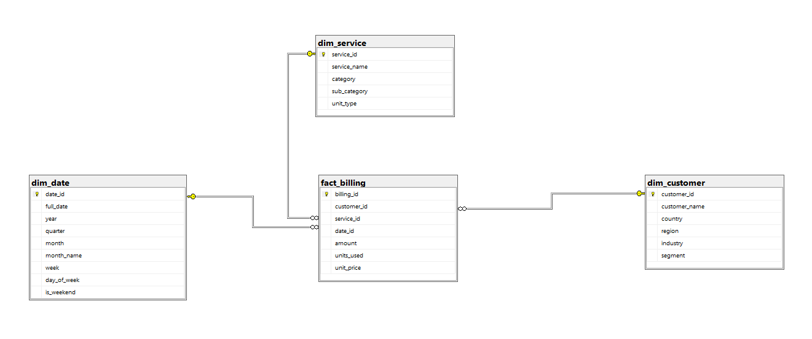

# billing-data-warehouse

# 💡 Billing Data Warehouse (SQL Server)

A star schema data warehouse built on SQL Server for billing analytics.

## Schema

## Tables
| Table | Type | Description |
|---|---|---|
| `fact_billing` | Fact | Billing transactions |
| `dim_customer` | Dimension | Customer details |
| `dim_service` | Dimension | Service catalog |
| `dim_date` | Dimension | Date attributes (2020–2026) |
| `stg_billing` | Staging | Raw CSV data landing zone |

## How to Run
1. Open SQL Server Management Studio (SSMS)
2. Run scripts in order:
   - `sql/01_create_tables.sql`
   - `sql/02_load_dimensions.sql`
   - `sql/03_load_fact.sql`

## Dataset
15 billing records across 7 customers and 7 services.

## Tools
- SQL Server / SSMS
- T-SQL
